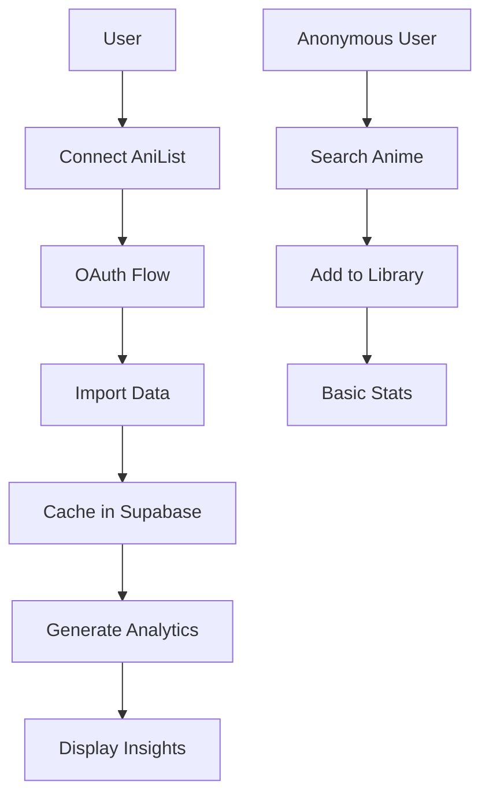

# AniList Integration - Power User Features

This document outlines the complete AniList integration system that adds advanced anime tracking and analytics features to the media tracking app.

## Overview

The AniList integration provides a **tiered system** with two levels of functionality:

### Basic Users (All Users)
- Search anime from AniList database
- Add anime to personal library
- Basic stats and tracking
- Rich metadata from AniList API

### Power Users (Connected AniList Account)
- **Full AniList account synchronization**
- **Advanced analytics and insights**
- **Smart recommendations**
- **Social features and comparisons**
- **Achievement system**
- **Data import/export**

## Architecture

### 1. Database Schema (`002_anilist_integration.sql`)

#### Enhanced Tables:
- **`profiles`** - Added AniList connection fields
- **`media_items`** - Enhanced with AniList metadata
- **`anilist_cache`** - Caches AniList user data
- **`user_analytics_cache`** - Performance optimization for analytics
- **`achievements`** - Gamification system
- **`analytics_events`** - User behavior tracking

### 2. API Client (`src/lib/api/anilist.ts`)

A robust GraphQL client supporting:
- **Anonymous queries** (search, trending, seasonal)
- **Authenticated queries** (user lists, personal data)
- **OAuth flow** (connection and token management)
- **Rate limiting** and error handling
- **Type safety** with TypeScript interfaces

### 3. OAuth Integration

#### Components:
- **`/api/auth/anilist/callback`** - Handles OAuth callback
- **`AniListConnection`** - Settings UI for account connection
- **Automatic data import** - Syncs user's AniList library

#### Security Features:
- Secure token storage
- Automatic token refresh
- Encrypted access tokens
- User consent validation

### 4. UI Components

#### Core Components:
- **`AniListConnection`** - Account connection interface
- **`AnimeAnalytics`** - Advanced analytics dashboard
- **`EnhancedAnimeSearch`** - AniList-powered search
- **Power user badges** - Visual status indicators

#### Features:
- **Responsive design**
- **Real-time updates**
- **Progressive enhancement**
- **Accessibility compliant**

## Features Breakdown

### 🔍 Enhanced Search
- **Real-time AniList search**
- **Rich metadata display**
- **One-click library addition**
- **Duplicate detection**
- **External links**

### 📊 Advanced Analytics (Power Users)
- **Viewing statistics**
- **Genre preferences**
- **Monthly activity**
- **Top-rated analysis**
- **Completion trends**
- **Visual charts and graphs**

### 🔄 Data Synchronization
- **Automatic import** of AniList library
- **Bi-directional sync** (future feature)
- **Conflict resolution**
- **Incremental updates**
- **Data validation**

### 🏆 Achievement System
- **Viewing milestones**
- **Genre exploration**
- **Streak tracking**
- **Social challenges**
- **Custom badges**

## API Endpoints

### Anonymous Access
```typescript
// Search anime
await anilistClient.searchAnime(query, page, perPage)

// Get trending
await anilistClient.getTrendingAnime(page, perPage)

// Get seasonal
await anilistClient.getSeasonalAnime(season, year, page, perPage)

// Get details
await anilistClient.getAnimeDetails(id)
```

### Authenticated Access
```typescript
// Get user's anime list
await anilistClient.getUserAnimeList(userId, accessToken)

// OAuth flow
const authUrl = anilistClient.getAuthUrl()
const { access_token, user } = await anilistClient.exchangeCodeForToken(code)
```

## Environment Variables

```bash
# AniList OAuth Configuration
ANILIST_CLIENT_ID=your_client_id
ANILIST_CLIENT_SECRET=your_client_secret

# App configuration
NEXT_PUBLIC_APP_URL=http://localhost:3000
```

## Database Setup

1. **Run the migration:**
```bash
npx supabase db push
```

2. **Or manually apply:** Copy SQL from `supabase/migrations/002_anilist_integration.sql`

## Component Usage

### Account Connection
```tsx
import { AniListConnection } from '@/components/anilist/AniListConnection'

// In settings page
<AniListConnection />
```

### Analytics Dashboard
```tsx
import { AnimeAnalytics } from '@/components/anilist/AnimeAnalytics'

// In analytics page
<AnimeAnalytics />
```

### Enhanced Search
```tsx
import { EnhancedAnimeSearch } from '@/components/anilist/EnhancedAnimeSearch'

// In search page
<EnhancedAnimeSearch />
```

## Data Flow



## Power User Conversion Flow

1. **Discovery** - User sees locked features
2. **Education** - Learn about power user benefits
3. **Connection** - Simple OAuth flow
4. **Import** - Automatic data synchronization
5. **Analytics** - Immediate value delivery
6. **Engagement** - Advanced features unlock

## Performance Optimizations

### Caching Strategy
- **AniList API responses** cached in Supabase
- **Analytics calculations** pre-computed
- **Image optimization** via Next.js
- **Database indexing** on key fields

### Lazy Loading
- **Analytics on demand**
- **Progressive image loading**
- **Component code splitting**
- **Data pagination**

## Testing

Run the integration tests:
```bash
node test/anilist-integration.test.js
```

## Security Considerations

### Data Protection
- **Encrypted token storage**
- **Minimal data collection**
- **User consent required**
- **Data deletion support**

### API Security
- **Rate limiting compliance**
- **Error handling**
- **Input validation**
- **CSRF protection**

## Future Enhancements

### Planned Features
- **Bi-directional sync** with AniList
- **Social features** (friend comparisons)
- **Advanced recommendations** using ML
- **Mobile app integration**
- **Offline support**

### Scalability
- **Background job processing**
- **CDN integration**
- **Database sharding**
- **Microservices architecture**

## Troubleshooting

### Common Issues

**OAuth not working:**
- Check client ID/secret
- Verify redirect URI
- Ensure environment variables are set

**Search returning no results:**
- Check AniList API status
- Verify network connectivity
- Review rate limiting

**Analytics not loading:**
- Confirm power user status
- Check database migration
- Verify user has anime data

**Performance issues:**
- Clear analytics cache
- Check database indexes
- Review query optimization

## Support

For issues related to AniList integration:
1. Check the troubleshooting section
2. Review the test script output
3. Check browser console for errors
4. Verify database schema is up to date

## Contributing

When contributing to AniList integration:
1. Follow TypeScript best practices
2. Add comprehensive error handling
3. Update tests for new features
4. Document breaking changes
5. Consider privacy implications

---

**Note:** This integration respects AniList's API terms of service and user privacy. All data synchronization requires explicit user consent.
