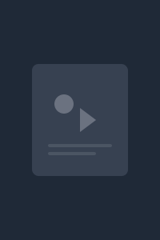

# Stacked - Advanced Media Tracking App



**Stacked** is a comprehensive media tracking application that allows users to discover, track, and organize their entertainment across multiple platforms including movies, TV shows, books, anime, games, and podcasts.


## 🚀 Features

### Core Functionality
- **Multi-Platform Media Tracking**: Track movies, TV shows, books, anime, games, and podcasts
- **Advanced Search & Discovery**: Search across multiple APIs (TMDB, IGDB, Jikan, OpenLibrary)
- **Smart Ratings & Reviews**: Rate and review your media with detailed notes
- **Personal Collections**: Organize media into custom collections
- **Progress Tracking**: Monitor your reading/watching/playing progress

### User Experience
- **Comprehensive Profile System**: Customizable profiles with avatar upload
- **Advanced Settings**: Theme selection, preferences, privacy controls
- **Onboarding Tour**: Guided introduction for new users
- **Empty States**: Helpful guidance when no content is available
- **Responsive Design**: Works seamlessly on desktop and mobile

### Technical Features
- **Real-time Sync**: Powered by Supabase for instant updates
- **Secure Authentication**: JWT-based auth with profile management
- **File Storage**: Avatar upload with Supabase Storage
- **Modern UI**: Built with Tailwind CSS and shadcn/ui components
- **Type Safety**: Full TypeScript implementation

## 🛠️ Tech Stack

### Frontend
- **Next.js 14** - React framework with App Router
- **TypeScript** - Type-safe development
- **Tailwind CSS** - Utility-first CSS framework
- **shadcn/ui** - High-quality component library
- **Zustand** - State management

### Backend & Services
- **Supabase** - Backend-as-a-Service
  - Authentication & User Management
  - PostgreSQL Database
  - File Storage
  - Real-time subscriptions
- **External APIs**:
  - **TMDB** - Movies and TV shows
  - **IGDB** - Video games
  - **Jikan** - Anime and manga
  - **OpenLibrary** - Books

## 🚀 Getting Started

### Prerequisites
- Node.js 18+ 
- npm or yarn
- Supabase account

### Installation

1. **Clone the repository**
   ```bash
   git clone <repository-url>
   cd stacked
   ```

2. **Install dependencies**
   ```bash
   npm install
   ```

3. **Set up environment variables**
   ```bash
   cp .env.example .env.local
   ```
   
   Fill in your environment variables:
   ```env
   # Supabase Configuration
   NEXT_PUBLIC_SUPABASE_URL=your_supabase_url
   NEXT_PUBLIC_SUPABASE_ANON_KEY=your_supabase_anon_key
   
   # External API Keys
   NEXT_PUBLIC_TMDB_API_KEY=your_tmdb_api_key
   NEXT_PUBLIC_IGDB_CLIENT_ID=your_igdb_client_id
   IGDB_CLIENT_SECRET=your_igdb_client_secret
   IGDB_ACCESS_TOKEN=your_igdb_access_token
   ```

4. **Set up Supabase**
   - Follow the detailed setup guide in [`SUPABASE_SETUP.md`](SUPABASE_SETUP.md)
   - Run database migrations
   - Set up avatar storage bucket (see [`AVATAR_SETUP.md`](AVATAR_SETUP.md))

5. **Run the development server**
   ```bash
   npm run dev
   ```

6. **Open your browser**
   Navigate to [http://localhost:3000](http://localhost:3000)

## 📱 Key Pages & Features

### 🏠 Dashboard
- Overview of recently added media
- Quick stats and activity
- Onboarding tour for new users

### 🔍 Search & Discovery
- Multi-platform search across all media types
- Advanced filters by genre, year, rating
- Trending and popular content
- Save searches for later

### 📚 Library
- View all tracked media
- Filter by status (completed, in-progress, planned)
- Sort by rating, date added, title
- Quick edit with inline controls

### 👤 Profile
- Personal statistics and achievements
- Media breakdown by type
- Activity timeline
- Public/private profile settings

### ⚙️ Settings
- **Profile**: Avatar upload, bio, display name
- **Preferences**: Theme, language, default views
- **Privacy**: Public profile, activity visibility
- **Data**: Export data, clear cache, reset onboarding

## 🗄️ Database Schema

The app uses a comprehensive PostgreSQL schema with:

- **Profiles** - User profile information and avatars
- **Media Items** - All media content with external API integration
- **User Media** - User's relationship with media (ratings, reviews, status)
- **Collections** - Custom user-created collections
- **Tags** - Flexible tagging system

See [`supabase/migrations/001_initial_schema.sql`](supabase/migrations/001_initial_schema.sql) for the complete schema.

## 🎨 Design System

Built with a consistent design system featuring:
- **Glass morphism** effects
- **Gradient accents** 
- **Dark/Light theme** support
- **Responsive breakpoints**
- **Accessible components**
- **Consistent spacing** and typography

## 🤝 Contributing

1. Fork the repository
2. Create a feature branch (`git checkout -b feature/amazing-feature`)
3. Commit your changes (`git commit -m 'Add amazing feature'`)
4. Push to the branch (`git push origin feature/amazing-feature`)
5. Open a Pull Request

## 📄 License

This project is licensed under the MIT License.

## 🙏 Acknowledgments

- [Supabase](https://supabase.com) - Backend infrastructure
- [TMDB](https://www.themoviedb.org) - Movie and TV data
- [IGDB](https://www.igdb.com) - Video game data
- [Jikan](https://jikan.moe) - Anime and manga data
- [OpenLibrary](https://openlibrary.org) - Book data
- [shadcn/ui](https://ui.shadcn.com) - Component library

---

**Built with ❤️ using Next.js and Supabase**

Built with ❤️ using modern web technologies for the ultimate media tracking experience.
